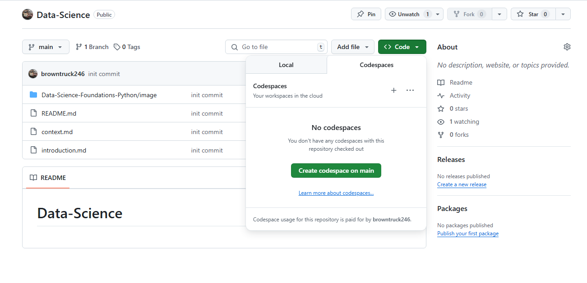

# Using GitHub Codespaces with this course
I'm going to show you how to work with GitHub Codespaces. Codespaces is a code editor in the cloud. With the full power of Visual Studio Code, it allows for real-world hands-on practice that mirrors software development in the workplace. This course was created using GitHub Codespaces. Using Codespaces you have everything you need to get going without needing complex installations or build tools. With one click you're ready to go.       

To practice, along with the course, you can create a Codespaces directly from the course overview page. First click open next to GitHub code spaces. If you're already logged in, you'll be directed to getting started with GitHub Codespaces page.  

 

```
https://docs.github.com/en/codespaces
https://mybinder.org/
```

[Context](./../context.md)